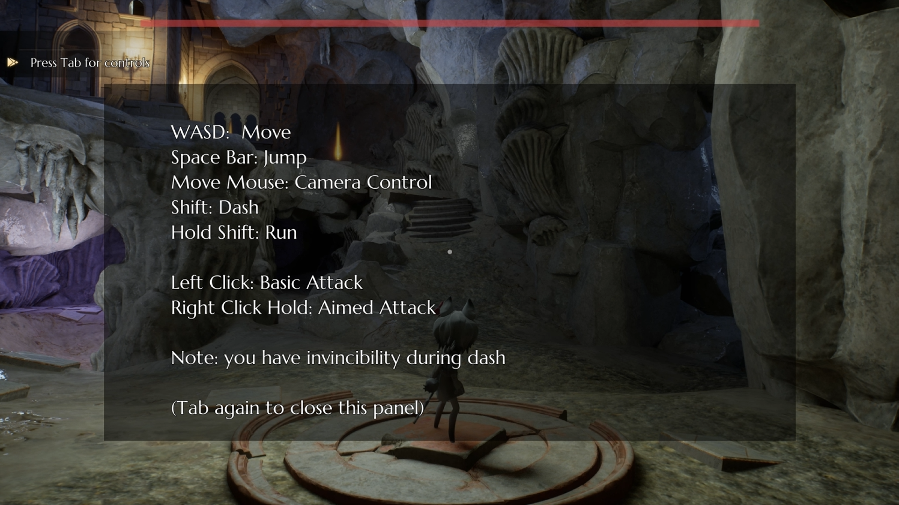

# The Last Link | UE 5.6 ARPG

## Game Overview
**The Last Link** is a time-shifting, perspective-switching action-adventure game for PC, where
the player controls two versions of the same character across two connected timelines: V, a
young deerfolk in the present, and Q, her corrupted future corrupted self created through
failed attempts to fix the past.

Rather than switching between two separate characters, the player glitches between forms
as a side effect of using a mysterious time-travel device discovered in a forgotten cave. This
device links V's and Q’s consciousness and bodies, causing them to swap between
present-world V and future-world Q unexpectedly or strategically. These transitions change
gameplay style, abilities, and the environment around the player.

V's gameplay takes place in the present world and is played in third-person, emphasizing
agility, platforming, stealth, and clever problem-solving. V uses light tools and magical relics,
relying on mobility and tactical thinking to survive corrupted threats and interact with puzzle
elements safely.

Q's gameplay occurs in a corrupted future timeline and is played in first-person, focusing on
destructive melee power, brute-force solutions, and chaotic combat. As Q, the player can
break barriers, clear corrupted biomass, and fight mutated beasts using raw strength and
corruption-infused abilities.

## Video Showcase

[Gameplay Demo](https://youtu.be/_aMzbMclobM?si=fZsL-Dqiks2ytRgX) 

[Trailer](https://youtu.be/zMPLVyIrX5A?si=GYaqr7qcw0_1IuK_)

## Player Controller

## Previews

  

  

